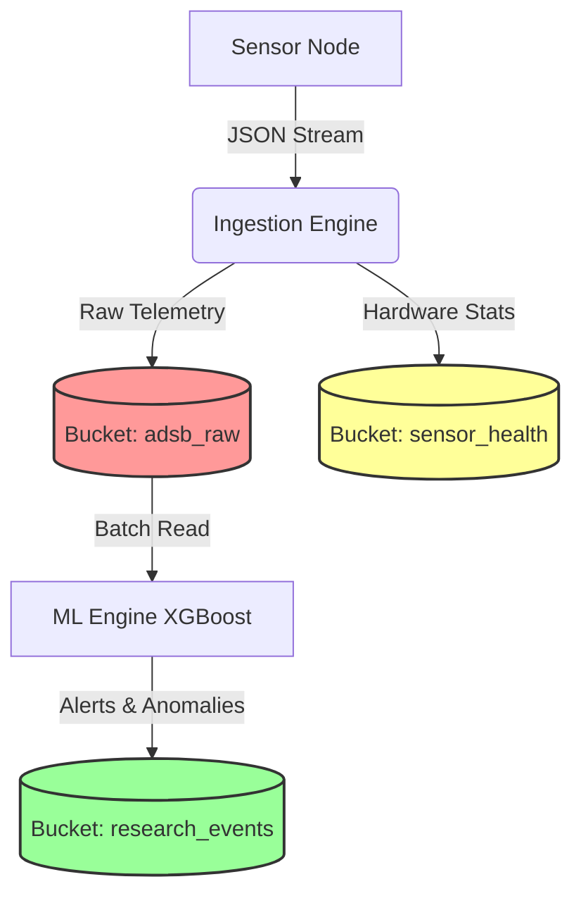

# 💾 Data Lifecycle & Retention Strategy

**Version:** 1.0.0
**Status:** Active (Phase 4: Panopticon)

To balance **forensic granularity** (seeing every packet) with **storage sustainability** (not filling the disk), we utilize a Tiered Storage Strategy across three distinct InfluxDB buckets.

## 1. The Storage Tiers

| Bucket Name | Retention Policy | Data Type | Purpose & Use Case |
| :--- | :--- | :--- | :--- |
| **`adsb_raw`** | **7 Days** | 🌊 **The Firehose**<br>High-frequency telemetry (100+ Hz). Includes raw RSSI, Phase, Baro Rates, and Trajectory points. | **Deep Forensics:** Used *only* when an incident is detected. Allows re-playing the exact signal environment of an attack. Auto-deleted to save space. |
| **`sensor_health`** | **90 Days** | 🏥 **Infrastructure**<br>Hardware stats: CPU Temp, Voltage, Disk Usage, Network Latency, Message Rates. | **Ops & Diagnostics:** Correlating hardware failures with signal loss. Answering: *"Did the voltage drop cause that gap in coverage last month?"* |
| **`research_events`** | **♾️ Infinite** | 🏆 **The Gold**<br>ML Inference results, confirmed anomalies, spoofing alerts, and ground truth matches. | **Long-Term Science:** The permanent record of the project. Contains the high-value "Needle in the Haystack" findings. **Never deleted.** |

## 2. Data Flow Architecture





## 3. Implementation Details
Technology: InfluxDB 2.x

Enforcement: Retention policies are enforced by the database engine automatically.

Safety: The research_events bucket requires a separate write token to prevent accidental pollution by raw logs.

### ⚡ Action: Auto-Create These Buckets (Ansible)

Documentation is good, but **automation is better**.

You can add this task to your `infra/ansible/roles/tower_core/tasks/influxdb.yml` to ensure these buckets actually exist with the correct retention rules every time you deploy.

```yaml
- name: 🗄️ Create InfluxDB Buckets with Retention Policies
  community.general.influxdb_bucket:
    url: "http://localhost:8086"
    token: "{{ tower_influx_token }}"
    org: "{{ tower_influx_org }}"
    name: "{{ item.name }}"
    retention_rules:
      - type: expire
        every_seconds: "{{ item.retention }}"
  loop:
    # 7 Days = 604800 seconds
    - { name: "{{ vault_influx_bucket_raw }}", retention: 604800 }
    # 90 Days = 7776000 seconds
    - { name: "{{ vault_influx_bucket_health }}", retention: 7776000 }
    # 0 = Infinite Retention
    - { name: "{{ vault_influx_bucket_research }}", retention: 0 }
```
