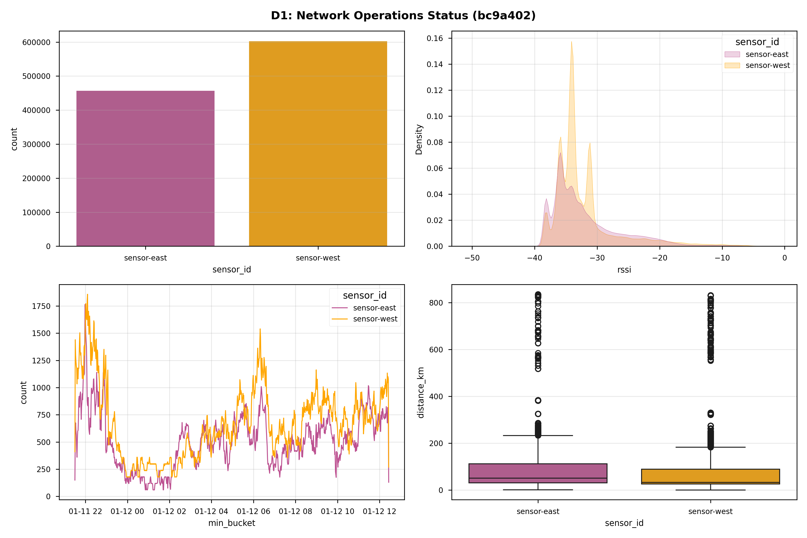
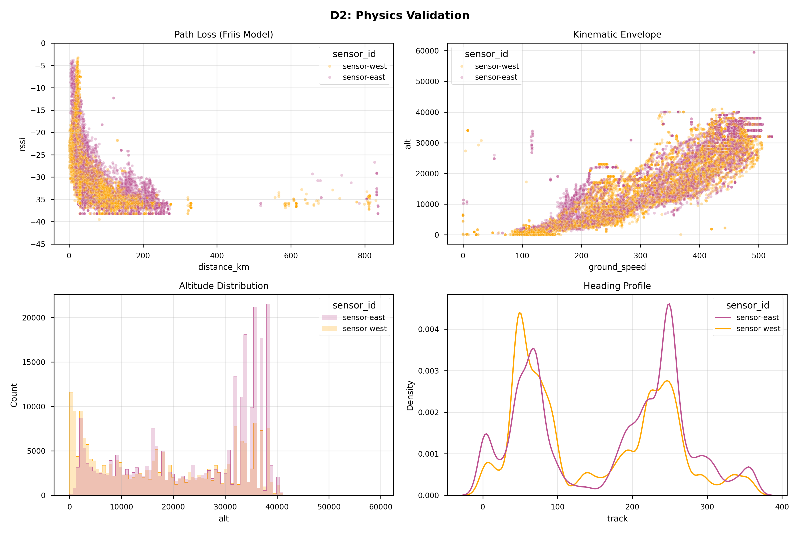
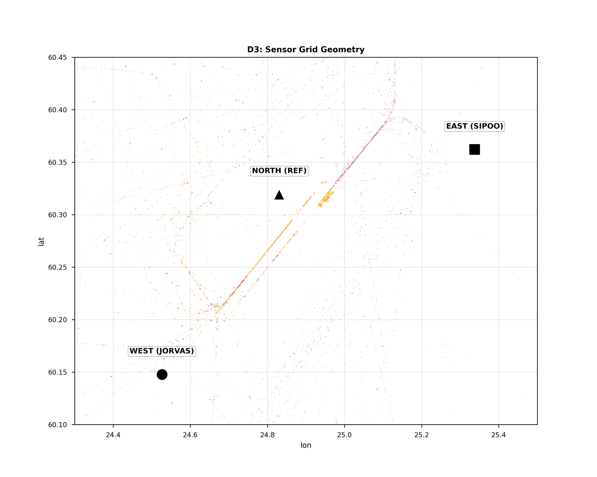
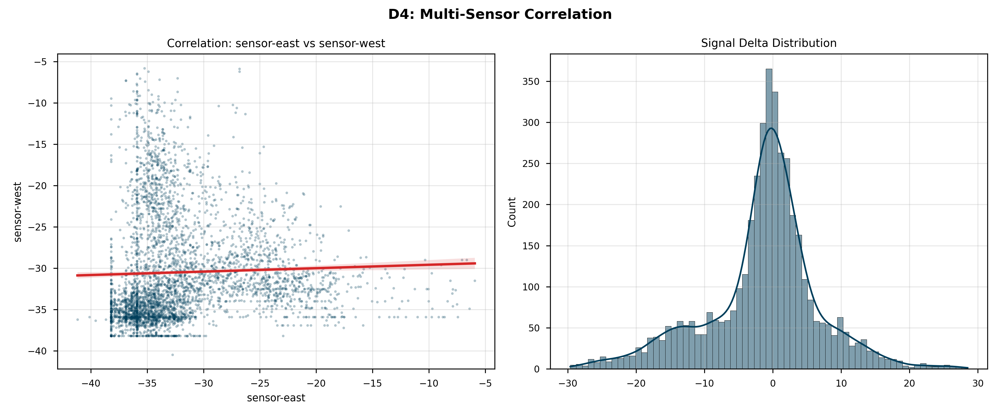

# 📡 ADS-B Grid Audit: 2026-01-12_1118

**Metadata:** `Git-SHA: c07c876 | Date: 2026-01-12`

## 1. 📋 Executive Summary
| Metric | Value |
|---|---|
| **Data Start** | `2026-01-11 21:30:45 UTC` |
| **Data End** | `2026-01-12 08:15:26 UTC` |
| **Total Messages** | 708,579 |
| **Unique Aircraft** | 194 |
| **Active Sensors** | 2 |

## 2. 🏥 Data Health Check
|      |   Missing Rows |   Missing % |
|:-----|---------------:|------------:|
| lat  |         443388 |       62.57 |
| lon  |         443388 |       62.57 |
| alt  |         224462 |       31.68 |
| rssi |              0 |        0    |

## 3. 📊 Fleet Performance Matrix
### 3.1 Packet Volume
| sensor_id   |   Packets |   Share % |
|:------------|----------:|----------:|
| sensor-east |    303907 |      42.9 |
| sensor-west |    404672 |      57.1 |

### 3.2 Signal Forensics (RSSI)
| sensor_id   |   Avg RSSI |   Peak Signal |   Noise Floor |   Std Dev |
|:------------|-----------:|--------------:|--------------:|----------:|
| sensor-east |     -32.27 |          -1.8 |         -49.5 |      5.49 |
| sensor-west |     -32.13 |          -2.7 |         -49.5 |      5.31 |

### 3.3 Spatial Coverage
| sensor_id   |   Max Range (km) |   Avg Alt (ft) |   Unique Aircraft |
|:------------|-----------------:|---------------:|------------------:|
| sensor-east |            836   |        24405.2 |               170 |
| sensor-west |            831.8 |        18032.8 |               174 |

## 4. 🖼️ Visual Evidence

## 5. 📚 Research Data Schema
Comprehensive definition of all collected data fields.

### 5.1 Aircraft Telemetry (`aircraft.json`)
| Field | Unit | Description | Relevance |
| :--- | :--- | :--- | :--- |
| `hex` | 24-bit | Unique ICAO Address | Target ID |
| `flight` | String | Call Sign | Identification |
| `squawk` | Octal | Transponder Code | ATC Assignment |
| `lat`/`lon` | Deg | WGS84 Position | Geolocation |
| `alt_baro` | Feet | Barometric Altitude | Vertical Profile |
| `alt_geom` | Feet | GNSS Altitude | Anti-Spoofing (Check vs Baro) |
| `gs` | Knots | Ground Speed | Kinematics |
| `track` | Deg | True Track | Heading Analysis |
| `baro_rate` | ft/min | Climb/Sink Rate | Vertical Dynamics |
| `nic` | 0-11 | Nav Integrity Category | **Spoofing Indicator (Trust)** |
| `sil` | 0-3 | Source Integrity Level | **Spoofing Indicator (Probability)** |
| `nac_p` | 0-11 | Nav Accuracy Category | **Spoofing Indicator (Precision)** |
| `rc` | Meters | Radius of Containment | Safety Bubble |
| `version` | Int | DO-260 Standard | 0=Old, 2=DO-260B |
| `rssi` | dBFS | Signal Strength | Receiver Proximity |

### 5.2 Hardware Stress (`stats.json`)
Detailed SDR and decoder performance metrics.
| Field | Sub-Field | Description | Criticality |
| :--- | :--- | :--- | :--- |
| `local` | `samples_processed` | Total RF samples read from SDR. | Throughput |
| `local` | `samples_dropped` | **Samples lost due to CPU/USB lag.** | **HIGH** (Data Loss) |
| `local` | `mode_s` | Valid Mode-S preambles detected. | Signal Quality |
| `local` | `signal` | Mean Signal Level (dBFS). | Gain Tuning |
| `local` | `noise` | Noise Floor (dBFS). | Environment |
| `local` | `strong_signals` | Count of signals > -3dBFS. | **LNA Overload** |
| `remote` | `modes` | Messages received from network neighbors. | Grid Health |
| `cpr` | `airborne`/`surface` | Compact Position Reports decoded. | Geo-Efficiency |
| `cpr` | `global_bad` | CPR packets discarded (Ambiguous). | Decoder Stress |
| `cpu` | `demod` | Time spent demodulating RF. | CPU Load |
| `cpu` | `background` | Time spent in housekeeping. | Overhead |

### 5.3 GNSS Navigation (`_gnss_log.csv`)
Precise positioning data from u-blox/SiRF receivers.
| Field | Unit | Description |
| :--- | :--- | :--- |
| `timestamp` | UTC | Time of fix. |
| `lat`/`lon` | Deg | Sensor WGS84 Position. |
| `alt` | Meters | Height Above Ellipsoid (HAE). |
| `fix` | Enum | 0=No Fix, 1=2D, 2=3D, 4=RTK-Fixed. |
| `sats` | Int | Number of satellites used. |
| `hdop` | Float | Horizontal Dilution of Precision. |

### 5.4 System Health & Storage (`hardware_health.csv`)
Forensic logs for diagnosing node crashes and outages.
| Field | Unit | Description |
| :--- | :--- | :--- |
| `timestamp` | ISO | Log time. |
| `node` | String | Hostname (e.g., sensor-west). |
| `Temp_C` | Celsius | CPU SoC Temperature. |
| `Throttled_Hex` | Hex | **0x50000 = Under-Voltage Occurred.** |
| `Clock_Arm_Hz` | Hz | Current CPU Frequency (Throttling check). |
| `disk_used_kb` | KB | Storage consumed by logs. |
