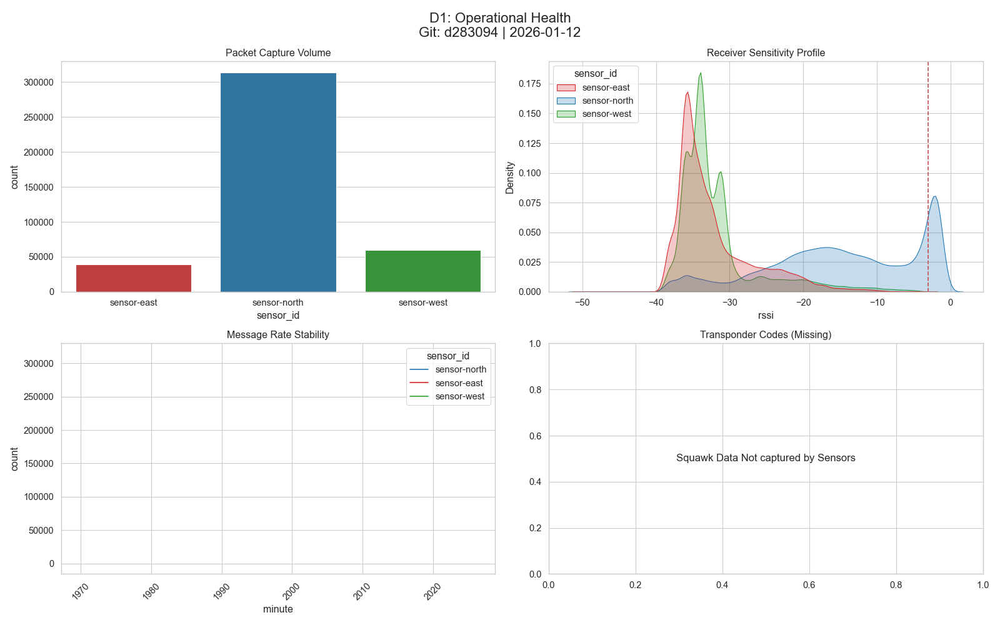
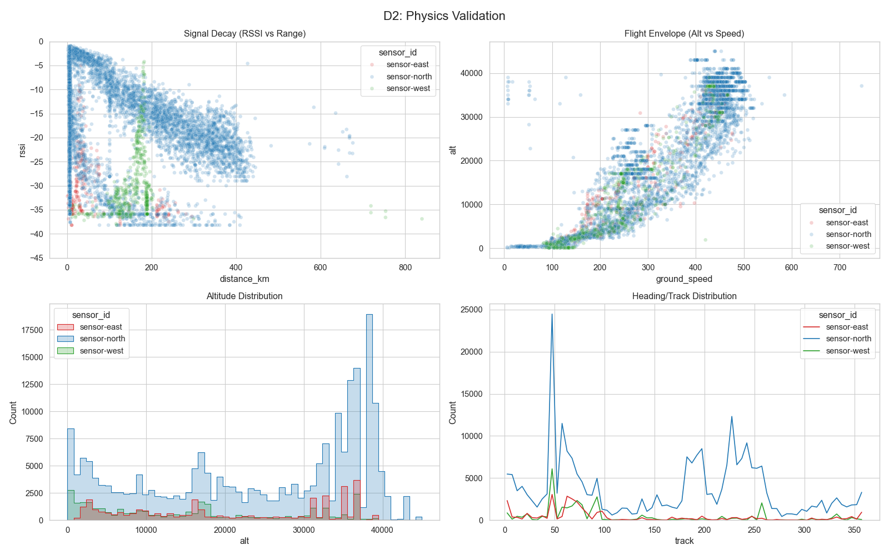
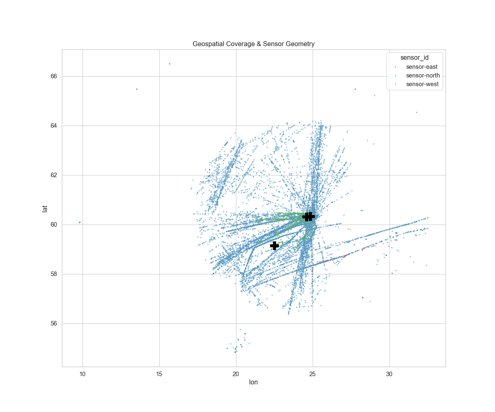
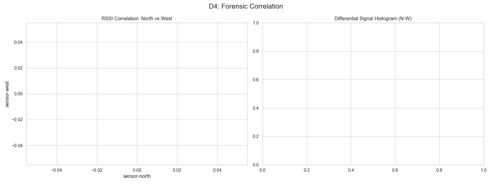

# 🛰️ ADS-B Grid Research Audit
**Run ID:** 2026-01-12_0108 | **Git:** Git: d283094 | 2026-01-12

## 1. 📊 The Data Dictionary
| sensor_id    |   ('rssi', 'mean') |   ('rssi', 'min') |   ('rssi', 'max') |   ('rssi', 'count') |   ('alt', 'mean') |   ('alt', 'min') |   ('alt', 'max') |   ('alt', 'count') |   ('distance_km', 'mean') |   ('distance_km', 'min') |   ('distance_km', 'max') |   ('distance_km', 'count') |
|:-------------|-------------------:|------------------:|------------------:|--------------------:|------------------:|-----------------:|-----------------:|-------------------:|--------------------------:|-------------------------:|-------------------------:|---------------------------:|
| sensor-east  |             -32.1  |             -49.5 |              -3.7 |               39216 |           20727.6 |              875 |            39025 |              33300 |                     72.36 |                     0    |                   817.1  |                      12921 |
| sensor-north |             -14.74 |             -49.5 |              -0.7 |              314203 |           23896.2 |                0 |            45000 |             223630 |                    130.67 |                     1.38 |                   678.53 |                     314203 |
| sensor-west  |             -31.68 |             -49.5 |              -3.7 |               59455 |           15210.7 |               25 |            39000 |              33424 |                    165    |                     0    |                   860.56 |                      27284 |

### 1.1 Transponder Codes
> *Squawk codes were not present in the ingested dataset.*

## 2. 🖼️ Visual Evidence
### D1: Operational Health

### D2: Physics & Kinematics

### D3: Spatial Coverage

### D4: Forensic Correlation

