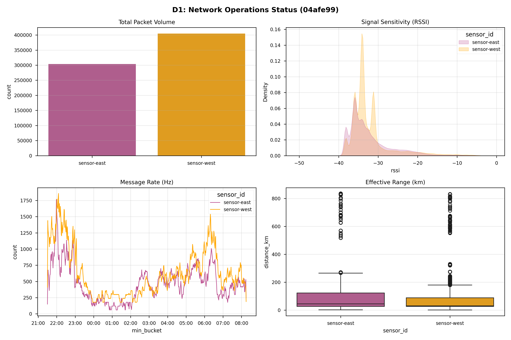
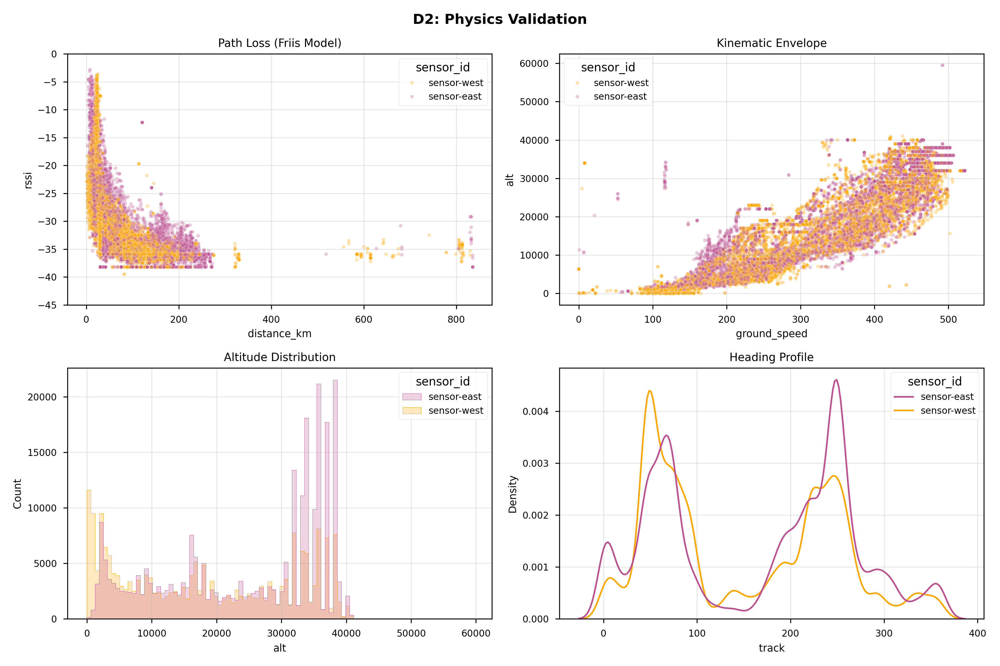
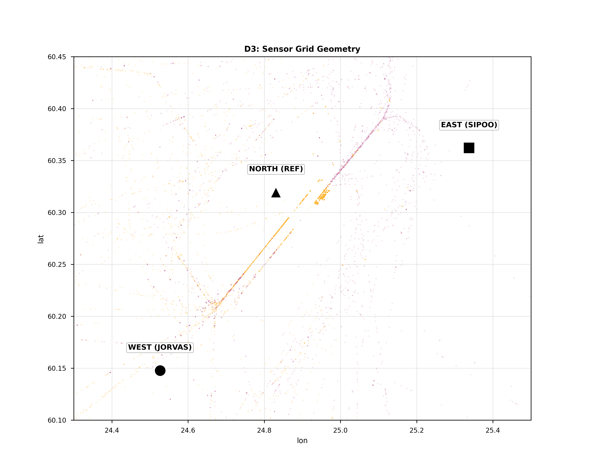
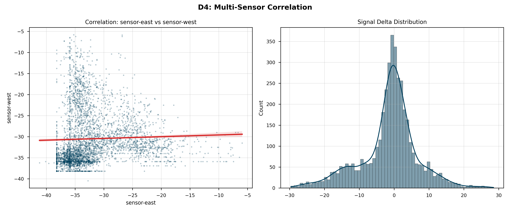

# 📡 ADS-B Grid Audit: 2026-01-12_1158

**Metadata:** `Git-SHA: 04afe99 | Date: 2026-01-12`

## 1. 📋 Executive Summary
| Metric | Value |
|---|---|
| **Data Start** | `2026-01-11 21:30:45 UTC` |
| **Data End** | `2026-01-12 08:15:26 UTC` |
| **Total Valid Samples** | **708,579** |
| **Active Sensors** | 2 |
| **Detected Anomalies** | **4,351** (1.00%) |

## 2. 🏥 Data Health Check
|      |   Missing Rows |   Missing % |
|:-----|---------------:|------------:|
| lat  |         443388 |       62.57 |
| lon  |         443388 |       62.57 |
| alt  |         224462 |       31.68 |
| rssi |              0 |        0    |

## 3. 📊 Fleet Performance Matrix
### 3.1 Packet Volume
| sensor_id   |   Packets |   Share % |
|:------------|----------:|----------:|
| sensor-east |    303907 |      42.9 |
| sensor-west |    404672 |      57.1 |

### 3.2 Signal Forensics (RSSI)
| sensor_id   |   Avg RSSI |   Peak Signal |   Noise Floor |   Std Dev |
|:------------|-----------:|--------------:|--------------:|----------:|
| sensor-east |     -32.27 |          -1.8 |         -49.5 |      5.49 |
| sensor-west |     -32.13 |          -2.7 |         -49.5 |      5.31 |

### 3.3 Spatial Coverage
| sensor_id   |   Max Range (km) |   Avg Alt (ft) |   Unique Aircraft |
|:------------|-----------------:|---------------:|------------------:|
| sensor-east |            836   |        24405.2 |               170 |
| sensor-west |            831.8 |        18032.8 |               174 |

## 4. 🖼️ Visual Evidence

## 5. 👻 Anomaly Detection (Ghost Hunt)
**Algorithm:** Isolation Forest (n=100, contamination=1%)

### 5.1 Top 5 Highest Confidence Anomalies
|      Hex | Sensor       |   Alt (ft) |   Speed (kts) |   RSSI | Confidence   |
|---------:|:-------------|-----------:|--------------:|-------:|:-------------|
| 4.61e+20 | sensor-north |      39000 |             8 |  -17.1 | 100.0%       |
| 4.61e+20 | sensor-north |      39000 |             8 |  -16.9 | 100.0%       |
| 4.61e+20 | sensor-north |      39000 |             8 |  -17.1 | 100.0%       |
| 4.61e+20 | sensor-north |      39000 |             8 |  -17.2 | 100.0%       |
| 4.61e+20 | sensor-north |      39000 |             8 |  -17.5 | 99.4%        |

### 5.2 Forensic Maps
*(See `docs/showcase/ghost_hunt/` for high-res forensic maps generated by `visualize_ghosts.py`)*

## 6. 📚 Research Data Schema
Comprehensive definition of all collected data fields.

### 6.1 Aircraft Telemetry (`aircraft.json`)
| Field | Unit | Description | Relevance |
| :--- | :--- | :--- | :--- |
| `hex` | 24-bit | Unique ICAO Address | Target ID |
| `flight` | String | Call Sign | Identification |
| `lat`/`lon` | Deg | WGS84 Position | Geolocation |
| `alt_baro` | Feet | Barometric Altitude | Vertical Profile |
| `nic` | 0-11 | Nav Integrity Category | **Spoofing Indicator (Trust)** |
| `rssi` | dBFS | Signal Strength | Receiver Proximity |

### 6.2 Hardware Stress (`stats.json`)
| Field | Unit | Description | Criticality |
| :--- | :--- | :--- | :--- |
| `samples_dropped` | Raw | **Buffer Overflows** | **CPU/USB Saturation** |
| `strong_signals` | Count | Signals > -3dBFS | **LNA Overload** |
