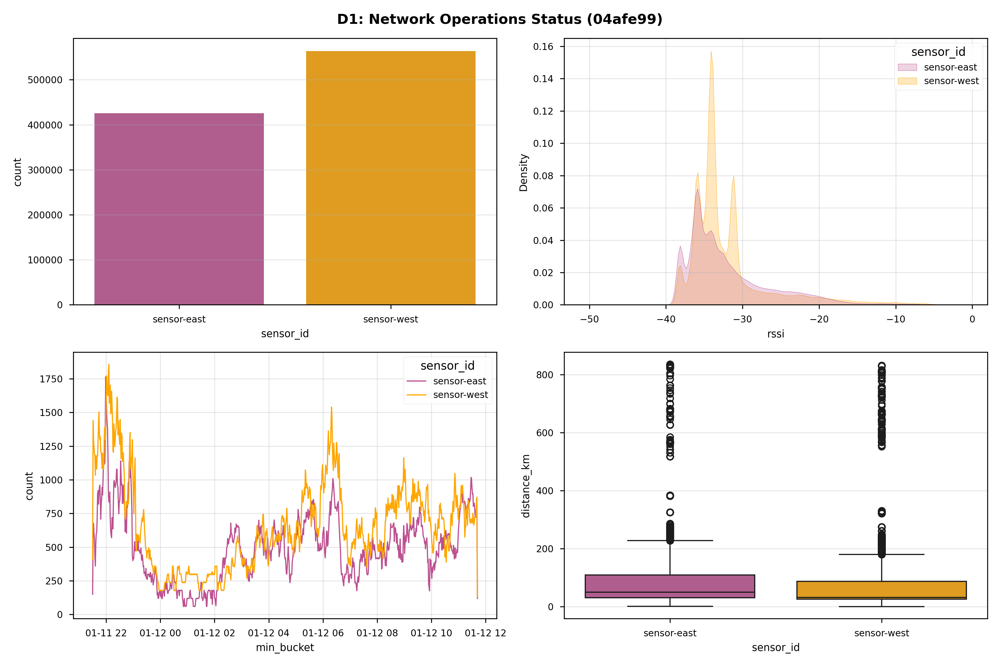
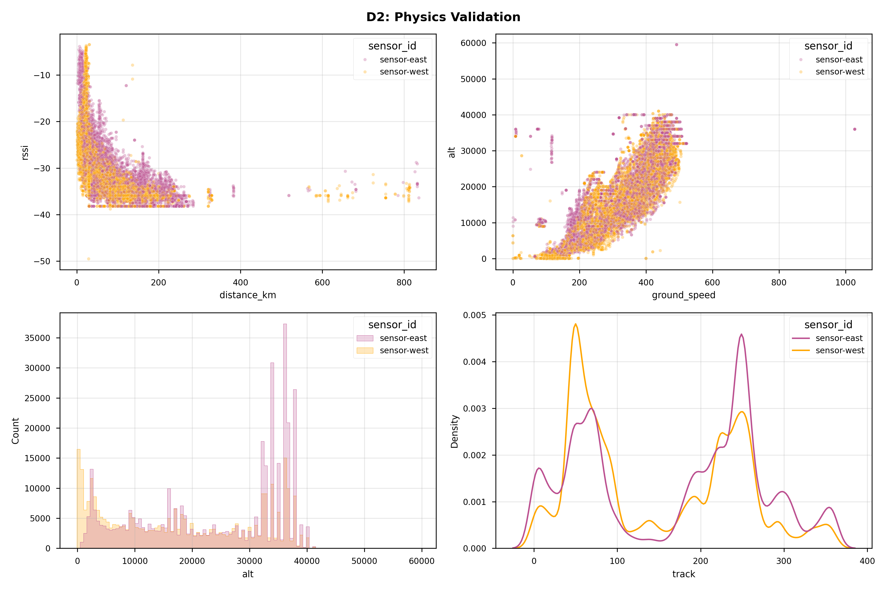
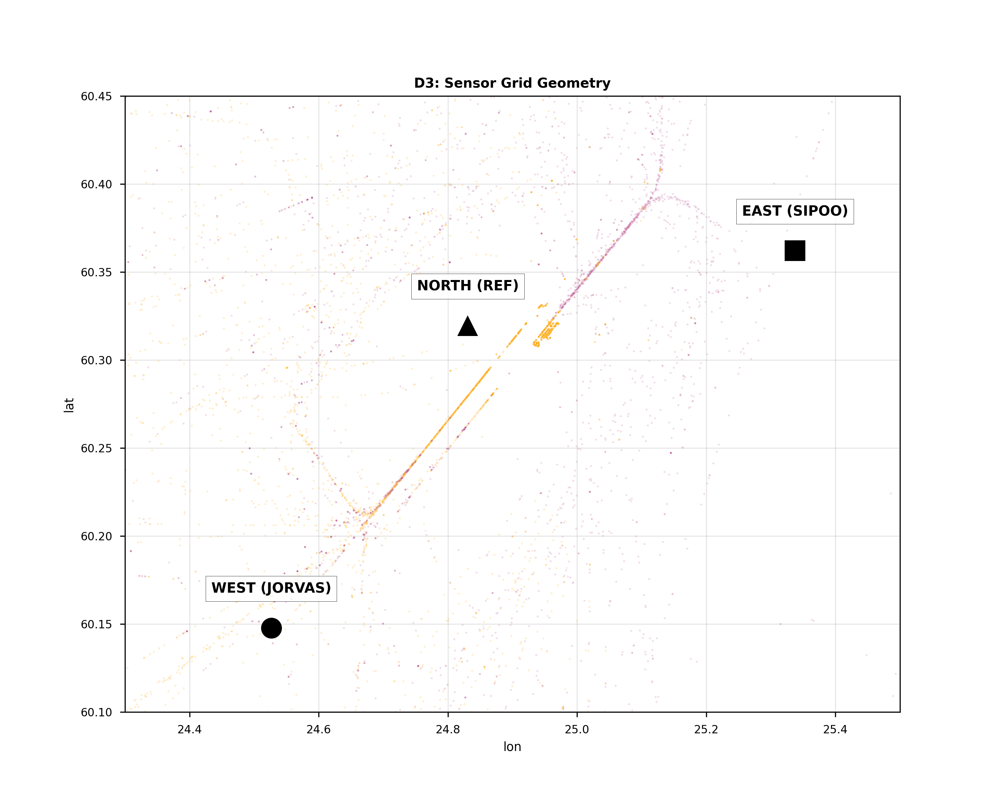
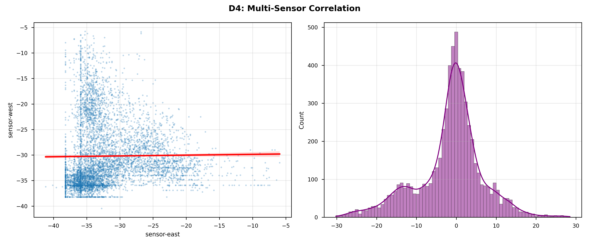

# 📡 ADS-B Grid Audit: 2026-01-12_1342

**Metadata:** `Git-SHA: 04afe99 | Date: 2026-01-12`

## 1. 📋 Executive Summary
| Metric | Value |
|---|---|
| **Data Start** | `2026-01-11 21:30 UTC` |
| **Data End** | `2026-01-12 11:42 UTC` |
| **Total Valid Samples** | **989,767** |
| **Active Sensors** | 2 |
| **Detected Anomalies** | **5,996** (1.00%) |

## 2. 🏥 Data Health Check
|      |   Missing Rows |   Missing % |
|:-----|---------------:|------------:|
| lat  |         573638 |       57.96 |
| lon  |         573638 |       57.96 |
| alt  |         288815 |       29.18 |
| rssi |              0 |        0    |

## 3. 📊 Fleet Performance Matrix
### 3.1 Packet Volume
| sensor_id   |   Packets |   Share % |
|:------------|----------:|----------:|
| sensor-east |    425911 |        43 |
| sensor-west |    563856 |        57 |

### 3.2 Signal Forensics (RSSI)
| sensor_id   |   mean |   max |   min |   std |
|:------------|-------:|------:|------:|------:|
| sensor-east | -31.98 |  -1.8 | -49.5 |  5.65 |
| sensor-west | -32.04 |  -2.7 | -49.5 |  5.37 |

### 3.3 Spatial Coverage
| sensor_id   |   distance_km |     alt |   hex |
|:------------|--------------:|--------:|------:|
| sensor-east |         836   | 24157.3 |   227 |
| sensor-west |         831.8 | 17939   |   231 |

## 4. 🖼️ Visual Evidence

## 5. 👻 Anomaly Detection (Ghost Hunt)
**Algorithm:** Isolation Forest (n=100, contamination=1%)

### 5.1 Top 5 Highest Confidence Anomalies
| Hex    | Sensor       |   Alt (ft) |   Speed (kts) |   RSSI | Confidence   |
|:-------|:-------------|-----------:|--------------:|-------:|:-------------|
| 4c01ed | sensor-north |      36025 |          10.2 |  -18.7 | 100.0%       |
| 4c01ed | sensor-north |      36025 |          10.2 |  -18.5 | 100.0%       |
| 4cae72 | sensor-north |      37000 |          54   |  -18.4 | 99.6%        |
| 4c01ed | sensor-north |      36025 |          10.2 |  -19.1 | 99.6%        |
| 4cae72 | sensor-north |      36975 |          54   |  -19.1 | 99.1%        |

### 5.2 Forensic Maps
*(See `docs/showcase/ghost_hunt/` for high-res forensic maps generated by `visualize_ghosts.py`)*

## 6. 📚 Research Data Schema
Comprehensive definition of all collected data fields.

### 6.1 Aircraft Telemetry (`aircraft.json`)
| Field | Unit | Description | Relevance |
| :--- | :--- | :--- | :--- |
| `hex` | 24-bit | Unique ICAO Address | Target ID |
| `flight` | String | Call Sign | Identification |
| `lat`/`lon` | Deg | WGS84 Position | Geolocation |
| `alt_baro` | Feet | Barometric Altitude | Vertical Profile |
| `nic` | 0-11 | Nav Integrity Category | **Spoofing Indicator (Trust)** |
| `rssi` | dBFS | Signal Strength | Receiver Proximity |

### 6.2 Hardware Stress (`stats.json`)
| Field | Unit | Description | Criticality |
| :--- | :--- | :--- | :--- |
| `samples_dropped` | Raw | **Buffer Overflows** | **CPU/USB Saturation** |
| `strong_signals` | Count | Signals > -3dBFS | **LNA Overload** |
