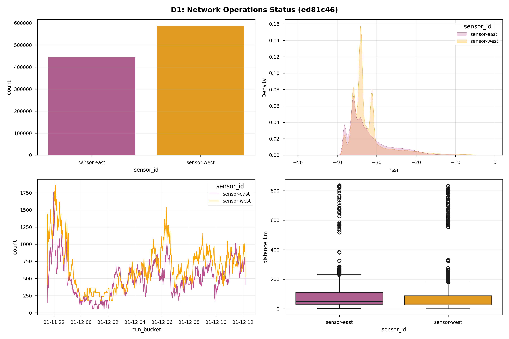
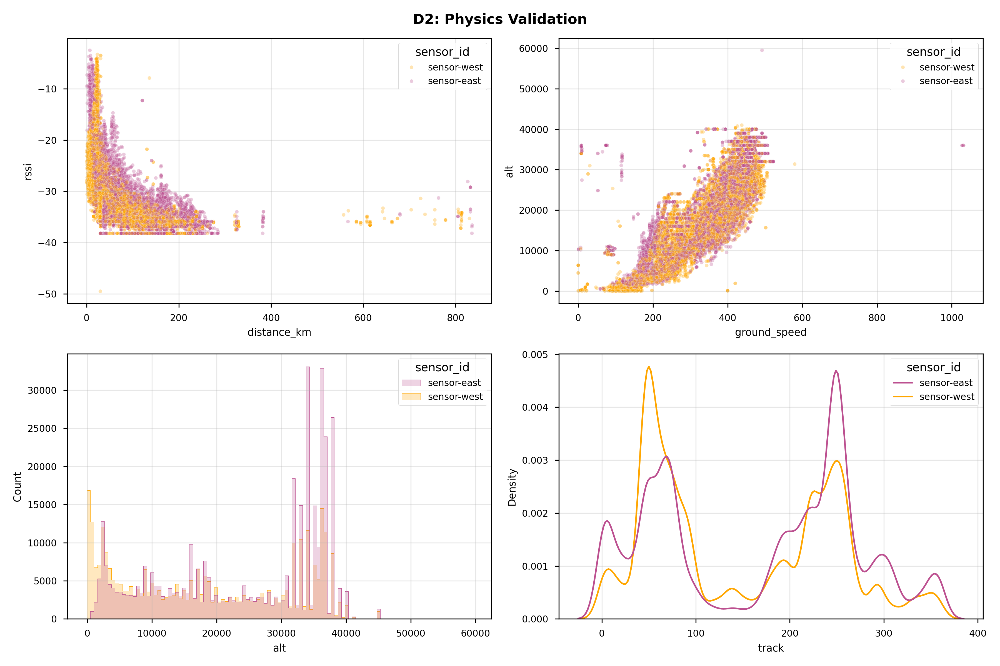
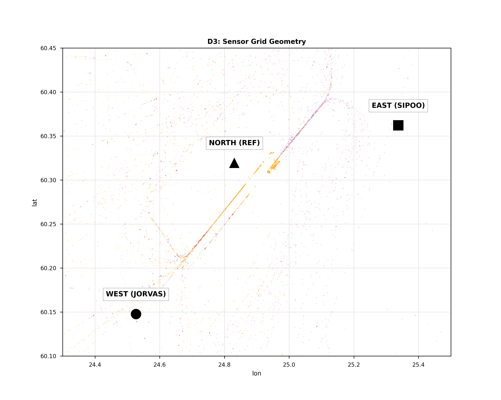
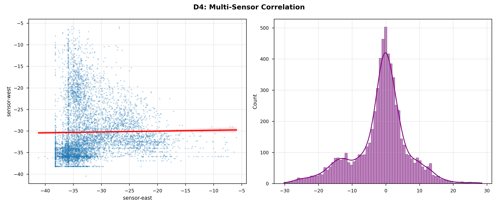

# 📡 ADS-B Grid Audit: 2026-01-12_1411

**Metadata:** `Git-SHA: ed81c46 | Date: 2026-01-12`

## 1. 📋 Executive Summary
| Metric | Value |
|---|---|
| **Data Start** | `2026-01-11 21:30 UTC` |
| **Data End** | `2026-01-12 12:10 UTC` |
| **Total Valid Samples** | **1,031,797** |
| **Active Sensors** | 2 |
| **Detected Anomalies** | **6,138** (1.00%) |

## 2. 🏥 Data Health Check
|      |   Missing Rows |   Missing % |
|:-----|---------------:|------------:|
| lat  |         602994 |       58.44 |
| lon  |         602994 |       58.44 |
| alt  |         297676 |       28.85 |
| rssi |              0 |        0    |

## 3. 📊 Fleet Performance Matrix
### 3.1 Packet Volume
| sensor_id   |   Packets |   Share % |
|:------------|----------:|----------:|
| sensor-east |    445086 |      43.1 |
| sensor-west |    586711 |      56.9 |

### 3.2 Signal Forensics (RSSI)
| sensor_id   |   mean |   max |   min |   std |
|:------------|-------:|------:|------:|------:|
| sensor-east | -31.95 |  -1.8 | -49.5 |  5.65 |
| sensor-west | -32.08 |  -2.7 | -49.5 |  5.34 |

### 3.3 Spatial Coverage
| sensor_id   |   distance_km |     alt |   hex |
|:------------|--------------:|--------:|------:|
| sensor-east |         836   | 24390.7 |   233 |
| sensor-west |         831.8 | 18339.1 |   239 |

## 4. 🖼️ Visual Evidence

## 5. 👻 Anomaly Detection (Ghost Hunt)
**Algorithm:** Isolation Forest (n=100, contamination=1%)

### 5.1 Top 5 Highest Confidence Anomalies
| Hex    | Sensor       |   Alt (ft) |   Speed (kts) |   RSSI | Confidence   |
|:-------|:-------------|-----------:|--------------:|-------:|:-------------|
| 4c01ed | sensor-north |      35975 |           8.1 |  -24.6 | 100.0%       |
| 4c01ed | sensor-north |      35975 |           8.1 |  -24   | 100.0%       |
| 4c01ed | sensor-north |      35975 |           8.1 |  -25   | 100.0%       |
| 4c01ed | sensor-north |      35975 |           8.1 |  -22.7 | 98.9%        |
| 4c01ed | sensor-north |      36000 |           8.1 |  -21.9 | 98.5%        |

### 5.2 Forensic Maps
*(See `docs/showcase/ghost_hunt/` for high-res forensic maps generated by `visualize_ghosts.py`)*

