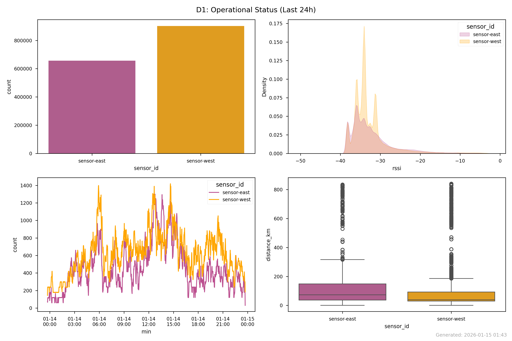
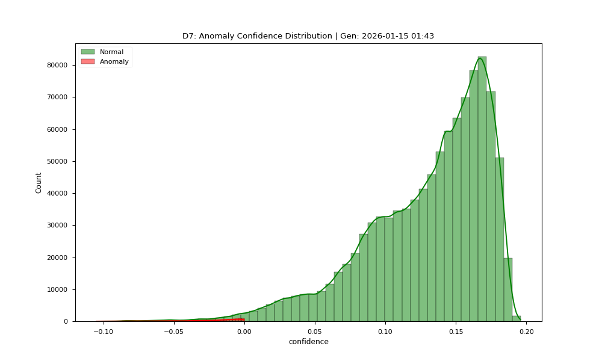

# 📡 ADS-B Grid Audit: run_2026-01-15_0143

**Generated:** 2026-01-15 01:43
**Analysis Window:** 24 Hours (2026-01-13 23:43 to 23:42 UTC)

## 1. Data Volume Summary
| Metric | Count | Description |
|---|---:|:---|
| **Total Historical Data** | **4,327,464** | All packets collected since inception |
| **Window Analysis Data** | **1,558,738** | Packets analyzed in this report |
| **Utilization** | 36.0% | Slice of total history |
| **Global Dataset Span** | 1970-01-01 00:00 to 2026-01-14 23:42 | Full range of collected data |

### 1.1 Fleet Performance Matrix (Windowed)
| sensor_id   |   Packets |
|:------------|----------:|
| sensor-east |    656407 |
| sensor-west |    902331 |

> ⚠️ **WARNING: Missing Telemetry**
> Sensors: **sensor-north** produced NO data in the last 24 hours.
> *Check Infrastructure Dashboard (D5/D7) for possible disk fill or thermal shutdown events.*

## 2. Visual Evidence

## 3. 👻 Anomaly Detection (Ensemble Tier 1)
**Models:** Isolation Forest + Local Outlier Factor (LOF)

- **Total Anomalies (Union):** 13,816 (0.97%)
- **💀 Confirmed Ghosts (Dual Model Agreement):** 0

### 3.1 High Signal Anomalies (Potential Spoofing)
| hex    | sensor_id   |   alt |   ground_speed |   rssi |   ensemble_score |
|:-------|:------------|------:|---------------:|-------:|-----------------:|
| 4601fa | sensor-west |  1800 |          173.8 |   -2   |                1 |
| 4601fa | sensor-west |  1825 |          175   |   -2.1 |                1 |
| 4601fa | sensor-west |  1900 |          173.8 |   -2.1 |                1 |
| 461f67 | sensor-west |  3775 |          251   |   -2.2 |                1 |
| 461f9b | sensor-west |  2700 |          201.7 |   -2.2 |                1 |

### 3.2 Forensic Maps

## 4. 📚 Research Data Schema
Comprehensive definition of all collected data fields.

### 4.1 Aircraft Telemetry (`aircraft.json`)
| Field | Unit | Description | Relevance |
|---|---|---|---|
| `hex` | 24-bit | Unique ICAO Address | Target ID |
| `flight` | String | Call Sign | Identification |
| `squawk` | Octal | Transponder Code | ATC Assignment |
| `lat`/`lon` | Deg | WGS84 Position | Geolocation |
| `alt_baro` | Feet | Barometric Altitude | Vertical Profile |
| `alt_geom` | Feet | GNSS Altitude | Anti-Spoofing (Check vs Baro) |
| `gs` | Knots | Ground Speed | Kinematics |
| `track` | Deg | True Track | Heading Analysis |
| `baro_rate` | ft/min | Climb/Sink Rate | Vertical Dynamics |
| `nic` | 0-11 | Nav Integrity Category | Spoofing Indicator (Trust) |
| `sil` | 0-3 | Source Integrity Level | Spoofing Indicator (Probability) |
| `nac_p` | 0-11 | Nav Accuracy Category | Spoofing Indicator (Precision) |
| `rc` | Meters | Radius of Containment | Safety Bubble |
| `version` | Int | DO-260 Standard | 0=Old, 2=DO-260B |
| `rssi` | dBFS | Signal Strength | Receiver Proximity |

### 4.2 Hardware Stress (`stats.json`)
Detailed SDR and decoder performance metrics.

| Field | Sub-Field | Description | Criticality |
|---|---|---|---|
| `local` | `samples_processed` | Total RF samples read from SDR | Throughput |
| `local` | `samples_dropped` | Samples lost due to CPU/USB lag | **HIGH (Data Loss)** |
| `local` | `mode_s` | Valid Mode-S preambles detected | Signal Quality |
| `local` | `signal` | Mean Signal Level (dBFS) | Gain Tuning |
| `local` | `noise` | Noise Floor (dBFS) | Environment |
| `local` | `strong_signals` | Count of signals > -3dBFS | **LNA Overload** |
| `remote` | `modes` | Messages received from network neighbors | Grid Health |
| `cpr` | `airborne/surface` | Compact Position Reports decoded | Geo-Efficiency |
| `cpr` | `global_bad` | CPR packets discarded (Ambiguous) | Decoder Stress |
| `cpu` | `demod` | Time spent demodulating RF | CPU Load |
| `cpu` | `background` | Time spent in housekeeping | Overhead |

### 4.3 GNSS Navigation (`_gnss_log.csv`)
Precise positioning data from u-blox/SiRF receivers.

| Field | Unit | Description |
|---|---|---|
| `timestamp` | UTC | Time of fix |
| `lat`/`lon` | Deg | Sensor WGS84 Position |
| `alt` | Meters | Height Above Ellipsoid (HAE) |
| `fix` | Enum | 0=No Fix, 1=2D, 2=3D, 4=RTK-Fixed |
| `sats` | Int | Number of satellites used |
| `hdop` | Float | Horizontal Dilution of Precision |

### 4.4 System Health & Storage (`hardware_health.csv`)
Forensic logs for diagnosing node crashes and outages.

| Field | Unit | Description |
|---|---|---|
| `timestamp` | ISO | Log time |
| `node` | String | Hostname (e.g., sensor-west) |
| `Temp_C` | Celsius | CPU SoC Temperature |
| `Throttled_Hex` | Hex | 0x50000 = Under-Voltage Occurred |
| `Clock_Arm_Hz` | Hz | Current CPU Frequency (Throttling check) |
| `disk_used_kb` | KB | Storage consumed by logs |
